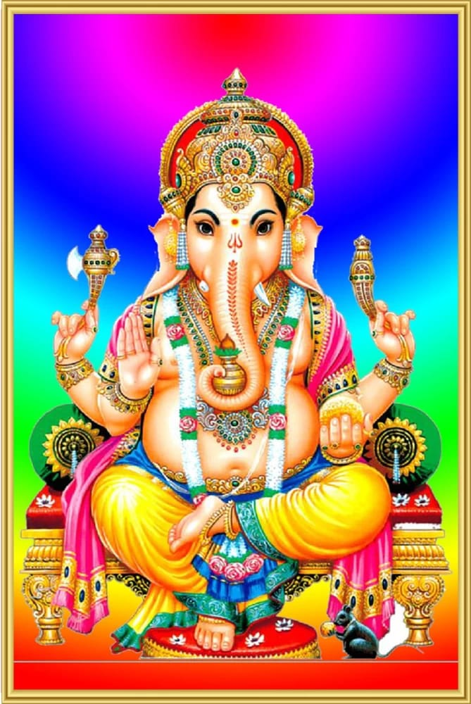
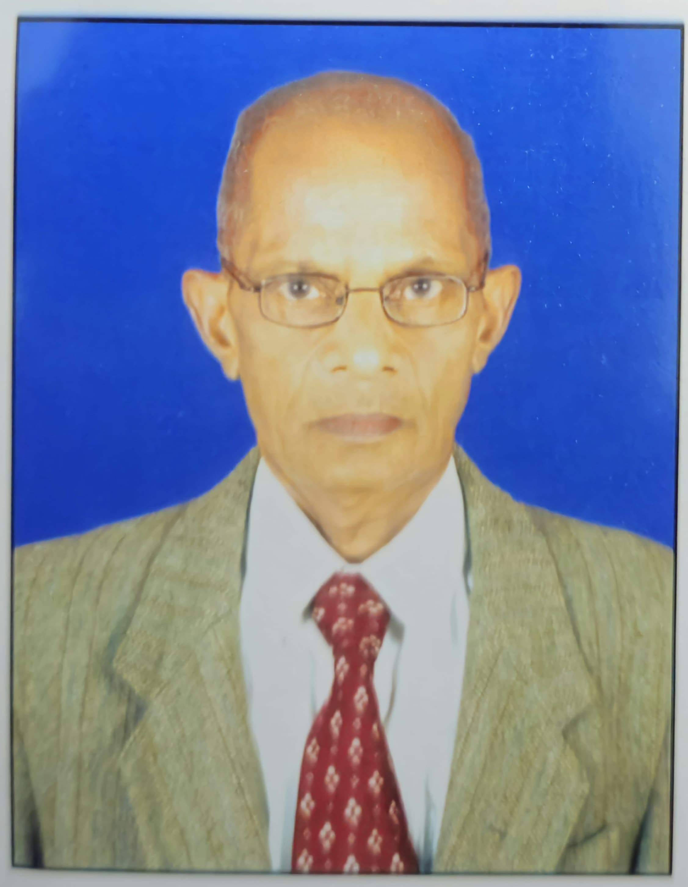
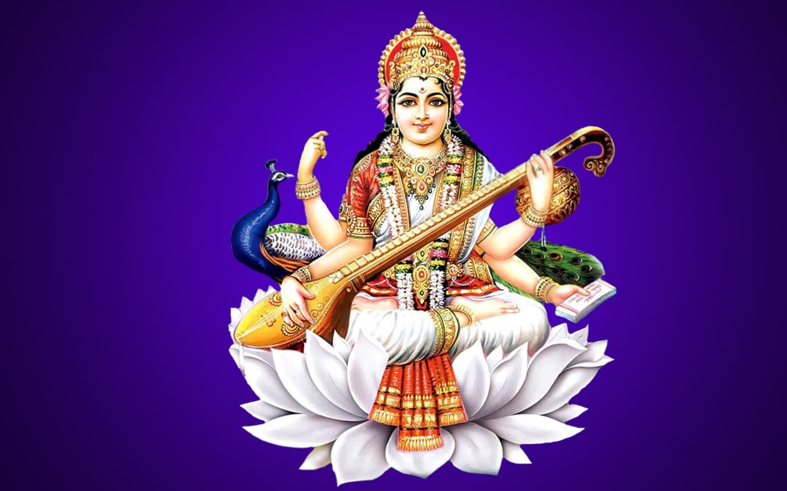

<h1 align="center">
  ॐ

  श्री मात्रे नमः  
</h1>

<h4 align="center">

</h4>

## 1. Self Introduction of Y. S. Sarma with whose efforts this study material is prepared.

<h3 align="center">

Y. S. SARMA L.C.E, M.A(Samskrutam), M.A(Jyotishyam), Civil Engineer.

</h3>

**Dear Reader,** 

I am a Civil Engineer. During my high school studies I had Hindi as one of the subjects. Also I have passed PRAVESIKA Hindi examination conducted by Dakshina Bharat Hindi Prachara Sabha, Madras. Hence I have knowledge on Devanagari Lepi. But I am unaware of sanskrit language. 

In 2002, I joined Samskruta Bharati organization as a student to learn Sanskrit. I have learnt the Vyakaranam and also conducted spoken sanskrit and vyakaranam classes for about 2 years. In 2004, I appeared the entrance examination conducted by SAMSKRUTA VIDYA PEETAM, a deemed university for vedas and vedangas being taught in sanskrit as a medium of instructions for regular and distance education courses. This is located in Tirupati, a university under central government in the ministry of HR. I passed the exam (first class) and taken Acharya (MA) with Phalita Jyotishyam as a subject in 2004-2006 in distance education. 

From 2006-2008, I attended many courses on Jyotishyam and Vyakaranam. During this period, I worked as a part time Sanskrit lecturer and taught sanskrit to degree students. Again in 2008-2010, I have undergone course Acharya (MA) in sanskrit sahithyam from the same university and again passed in first class. But then I had a feeling that I could not learn the sanskrit language from the root level. So, I have joined a 6 month course privately which is based on Astadhyaee method. This is as per the book SAMSKRUTA PATHANA PAATHANA VIDHI (SARALATHAMA VIDHI PART1) by Sri Brahmadatta Gigjnasu, a well experienced sanskrit scholar in Astadhyaee method in gurukulas. This is designed in forty-four lessons containing vyakaranam on Kriya Sidhi. That is grammar on Kriya Siddhi for those who cannot attend gurukulas for regular courses. This is a short course. Here I learnt the Siddhi Prakriya and I am happy over it. The teacher who had taught this book did not do the 2nd part, i.e. on Sabdas. With my previous experience and knowledge, I did the 2nd book, i.e., Sidhi Prakriya on Sabdas in about 6 months at home. 

I was not having clear idea about Krut and Unadi pratyayas which are needed for sabda sidhi. I could not get a guru. I could pick up outline material from various books and with my experience on sidhi prakriya, I could be able to do both in about 9 months from home. This has given me more confidence on sidhi prakriya. 

I have made hand written notes while doing the above works. I want to share my efforts with Sanskrit lovers and students who are interested to know the subject. I want to keep the notes to the reach of interested people by placing it online and my grandson Y. Karthik (M.Tech) helped in designing and doing all work needed and also to maintain it in future. I appreaciate his efforts. God bless him. 

Hope the readers may get the benifit of this notes. While making the notes I have referred various books as mentioned in the reference books. I did the work with the knowledge and experience I had. I am thankful to the authors and publishers of all the books with respects and with their SOWJANYAM.

## 2. Introduction to Sanskrit Vyakaram.

Samskrutam is a well structed language which is the mother of all languages of the world. This is the only language in the world which is having "root" as the base, i.e. Dhatu. In this language, there are more than 2000 Dhatus from which the words Subantam(Sabdaha) and Tingantam(Kriya Padam) are generated. In this language only these two types of words are there. It has a maximum of 63 letters as varnamala based on Maheswar Sutras which are also called as Pratyahaara Sutras. This is the same language for vedic and non-vedic versions. 

### DHATUMOOLAMIDAM SAMSKRUTAM. THE BASIS OF ANY LANGUAGE IS VYAKARANAM.
So much so for Samskrutam too. Maharshi Panini (2900 B.C.) had restructed the sanskrit language with the help of 5 books written by him. The group of books are called by a name **UPADESAHA**. They are
**1. SUTRAPATAHA**
**2. DHATUPATAHA**
**3. GANAPATAHA**
**4. UNADIKOSHAHA**
**5. LINGANUSASANAM**

## 3. Reference Books with respects to the authors and publishers (with their SOWJANYAM)
1. Books from Samskruta Bharati
2. Books from Chowkamba SuraBharati Publishers
3. Books from Sri Krishnanda Mutt
4. Books from Ramlal Kapoor Trust
5. Other textbooks and Sanskrit Koshas.

<h4 align="center">

</h4>

## 4. List of Contents with link
| S. No  | Name of File | No. of Pages | Language | Link
| ------------- | ------------- | ------------- | ------------- | ------------- | 
| 1. | PAANINEEYA UPADESAHA | 243 | Sanskrit, Telugu, English | https://drive.google.com/drive/folders/1e3_AZd6AHW2IgztiTSxJBwnqrbf8kpJ0?usp=sharing
| 2. | SAMSKRUTA BHASHA SOWRABHAM (4 parts) | 535 | Telugu, Sanskrit | https://drive.google.com/drive/folders/1_5VEncUJGmMnNKS1a1gDHWJar_pXkyE8?usp=sharing
| 3. | SAMSKRUTAM BINDER | 252 | Sanskrit, English, Telugu | https://drive.google.com/drive/folders/1m7g_88w-JTksAPqDWcvlu15LyBRcRVfi?usp=sharing
| 4. | VAKYA NIRMANAM |  | Sanskrit, Telugu | https://drive.google.com/drive/folders/1TF4imJUI9hyHdOtSUeWaYlTeugOu-sd1?usp=sharing
| 5. | SANATANA DHARMA | 304 | Sanskrit, English | https://drive.google.com/drive/folders/1TiJMTAU_ZzVAu7vz5IbWfA-2hStA9wRI?usp=sharing
| 6. | KRUT BINDER | 107 | Sanskrit | https://drive.google.com/drive/folders/1Kpytdx2YuEciLZln6IAe57P8e3gIbZMy?usp=sharing
| 7. | UNADI BINDER | 455 | Sanskrit | https://drive.google.com/drive/folders/1Y0we7H3uL07tsvghH-d9URSttHW9YHDc?usp=sharing
| 8. | KRUTYA PRATYAYAS | 5 | Sanskrit | https://drive.google.com/drive/folders/16uFJPXoBInzj44e_sMxuE_IhEpI9XF1S?usp=sharing
| 9. | KRIYA BINDER(with SIDHI AND SWARAH | 528 | Sanskrit, Telugu | https://drive.google.com/drive/folders/1Vl5mdexMo3aZYNbHDlB4UfzRVrN0BO7A?usp=sharing
| 10. | SABDA SIDDHI | 24 | Sanskrit | https://drive.google.com/drive/folders/13O6zVRFEaYxJfNdrzmQiBZ-PoB-njjPc?usp=sharing
| 11. | UPADESA SAARAHA | 18 | Sanskrit | https://drive.google.com/drive/folders/19RmgrdKyErjfbmvob-TZ6odG79r6ZVeV?usp=sharing
| 12. | ALANKAARAS (brief) | 76 | Sanskrit | https://drive.google.com/drive/folders/1zuYJcolvGvTuBt4tZNotyrZzYns_UjB8?usp=sharing
| 13. | SATRU AND SANACH PRATYAYAS | 36 | Sanskrit | https://drive.google.com/drive/folders/19MPGUwQAWenJvpORVDW4WNYekp6x3tTI?usp=drive_link
| 14. | LATE LAKAARAH | 101 | Sanskrit | https://drive.google.com/drive/folders/1TRI_eGhFsTJGtm5FC07lLdcLJjuh0uo_?usp=drive_link
| 15. | IRUT LAKARAAH | 2 | Sanskrit | https://drive.google.com/drive/folders/18U3cmiTj2VEyIqtrye73dicFbAYWzOoL?usp=drive_link
| 16. | AVYAYAANI | 15 | Sanskrit | https://drive.google.com/drive/folders/1MDMdBaYgl9mAbGGNzBtG_fG-2TnZzxa1?usp=sharing
| 17. | CHENDASI | 21 | Hindi | https://drive.google.com/drive/folders/1CLiGgGsygcYNKTfAjkbZoJ7EjTr9YJgB?usp=drive_link
| 18. | PHALITA JYOTISHYAM CONTENTS | 24 | Telugu, English | https://drive.google.com/drive/folders/1f6a1BXoVnbcTkzuFI2-AgVeBX7oZRfXQ?usp=drive_link
| 19. | VEDANTA CHANDAHA | 99 | Sanskrit | https://drive.google.com/drive/folders/1eNJPpm8BBi72LRLbdtCmPXqqFRnr4_ys?usp=drive_link
| 20. | SIKSHA SASTRAM | 58 | Sanskrit | https://drive.google.com/drive/folders/1EQMLACz4F5kuHW6bdDJ-tscZO7g0QsPp?usp=drive_link
| 21. | VEDANGA JYOTISHYAM | 228 | Sanskrit | https://drive.google.com/drive/folders/1pa_zldx64gh9Dn8tJgoygSypnxjqDiZZ?usp=drive_link
| 22. | NIRUKTAM | 143 | Sanskrit | https://drive.google.com/drive/folders/1qjvkADwty_KMmzFVOHlilTWQhI58wxZg?usp=drive_link
| 23. | VEDANGA KALPAHA | 289 | Sanskrit, Telugu, English | https://drive.google.com/drive/folders/1_B0pkGRdxXuAdNiWkMoBUTfx8QErv8OE?usp=drive_link
| 24. | TELUGU TO DEVANAGARI LIPI | 4 | Sanskrit, Telugu | https://drive.google.com/drive/folders/1_U5o6hyVJKHefTG2y3YCVe2BHAMiIZWn?usp=drive_link

