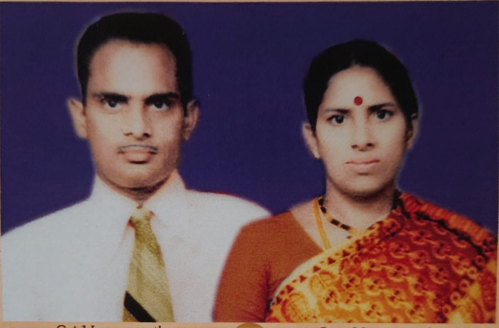
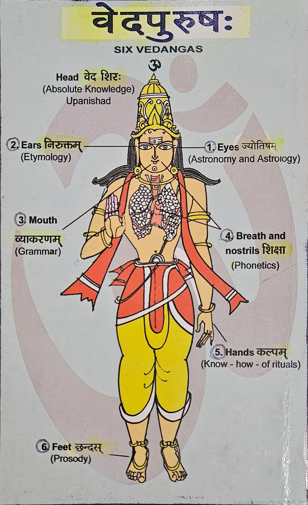
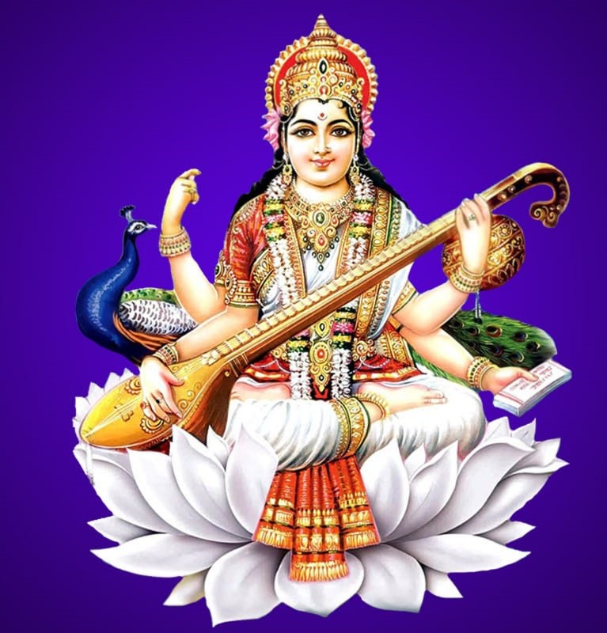
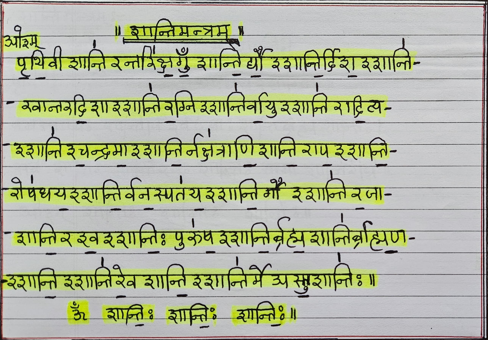
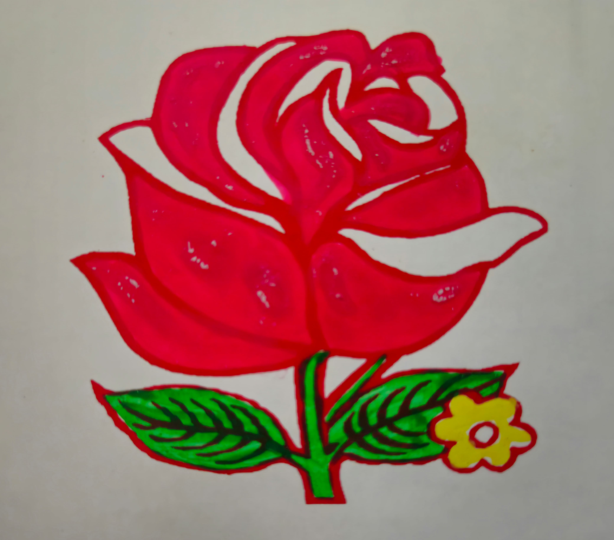

<h1 align="center">
  ॐ

  श्री मात्रे नमः  
</h1>

<h4 align="center">

</h4>

## 1. Self Introduction of Y. S. Sarma with whose efforts this study material is prepared.

<h3 align="center">

Smt & Sri Y. S. Sarma

I am thankful to **God** for giving me the grace to learn sanskrit from basics at my age of sixty plus which I never dreamt to learn in this lifetime. 

I am thankful to my wife Smt. Y Laxmi who has supported me all the way in learning sanskrit and obtaining two degrees and also in preparing handwritten notes of above 5000 pages and also scanning them as pdfs.

<h3 align="center">

Y. S. SARMA L.C.E, M.A(Samskrutam), M.A(Jyotishyam), Civil Engineer, D.O.B 1943

</h3>

**Dear Reader,** 

I am a Civil Engineer. During my high school studies I had Hindi as one of the subjects. Also I have passed PRAVESIKA (4th stage) Hindi examination conducted by Dakshina Bharat Hindi Prachara Sabha, Madras (Chennai). Hence I have knowledge on Devanagari Lepi. But I am unaware of sanskrit language. 

In 2002, I joined Samskruta Bharati organization as a student to learn Sanskrit. I have learnt the Vyakaranam and also conducted spoken sanskrit and vyakaranam classes. In 2004, I appeared the entrance examination conducted by SAMSKRUTA VIDYA PEETAM, a deemed university for vedas and vedangas being taught in sanskrit as a medium of instructions for regular and distance education courses. This is located in Tirupati, a university under central government in the ministry of HR. I passed the entrance exam and have taken Acharya (MA) with Phalita Jyotishyam as a subject in 2004-2006 in distance education and passed in first class. 

From 2006-2008, I attended many courses on Jyotishyam and Vyakaranam. During this period, I worked as a part time Sanskrit lecturer and taught sanskrit to degree students. Again in 2008-2010, I have undergone course Acharya (MA) in sanskrit sahithyam (distance education) from the same university and again passed in first class. But then I had a feeling that I could not learn the sanskrit language from the root level. So, I have joined a 6 month course privately which is based on Astadhyaee method. This is as per the book SAMSKRUTA PATHANA PAATHANA VIDHI (SARALATHAMA VIDHI PART1) by Sri Brahmadatta Gigjnasu, a well experienced sanskrit scholar in Astadhyaee method in gurukulas. This is designed in forty-four lessons containing vyakaranam (grammar) on Kriya Sidhi. It is for those who cannot attend gurukulas for regular courses of 4 years. This is a short course. Here I learnt the Siddhi Prakriya and I am happy over it. The teacher who had taught this book did not do the 2nd part, i.e. on Sabdas. With my previous experience and knowledge, I did the 2nd book, i.e., Sidhi Prakriya on Sabdas in about 3 months at home. 

I was not having clear idea about Krut and Unadi pratyayas which are needed for sabda sidhi. I could not get a guru. I could pick up outline material from various books and with my experience on sidhi prakriya, I was able to do both in about 9 months from home. Krut Pratyayas are taken from Astadhyayee 3rd chapter and Unadi Pratyayas from Sri Bhattojideekshita Panchapadi as well as Unadi Kosha. Sidhi Prakriya sutras are from Astadhyayee. This has given me more confidence on sidhi prakriya. 

I have made hand written notes while doing the above works. I want to share my efforts with Sanskrit lovers and students who are interested to know the subject. I want to keep the notes to the reach of interested people by placing it online and my grandson Y. Karthik (M.Tech) helped in designing the website and doing all work needed and also to maintain it in future. I appreaciate his efforts. God bless him. 

Hope the readers may get the benifit of this notes. While making the notes I have referred various books as mentioned in the reference books. I did the work with the knowledge and experience I had and with the help of books. I am thankful to the authors and publishers of all the books with respects and with their SOWJANYAM.

## WHERE THERE IS A WILL THERE IS A WAY

## 2. Introduction to Sanskrit Vyakaranam.

Samskrutam is a well structured language which is the mother of all languages of the world. This is the only language in the world which is having "root" as the base, i.e. Dhatu. In this language, there are more than 2000 Dhatus from which the words Subantam(Sabdaha) and Tingantam(Kriya Padam) are generated. In this language only these two types of words are there. It has a maximum of 63 letters as varnamala based on Maheswar Sutras which are also called as Pratyahaara Sutras. This is the same language for vedic and non-vedic versions. 

Maharshi Panini had generated 41 Pratyaharas from Pratyahara Sutras which are very useful in Astadhyayee Sutras, Sandhi, Samasas etc. The original (moola) dhathus and pratyayaas include ITH samgnas which are needed for various reasons. When we want to use them to construct a word, we have to first identify them with the help of 9 ITH sutras given in the Astadhyayee (1st chapter, 3rd padam). After eliminating them only we have to go for joining and making out the word. So sanskrit language is well designed like mathematics which is very much suitable for computer applications. 

<h3 align="center">

</h3>

**There are six Vedangas to support the functions of Vedas. They are:**
1. **Astronomy and Astrology**
2. **Niruktam**
3. **Vyakaranam**
4. **Siksha (Phonetics)**
5. **Kalpam (knowhow of rituals)**
6. **Chendas (Prosody)**

A brief information of these vedangas are given as per the rishi who had narrated them as available in the books. 

### DHATUMOOLAMIDAM SAMSKRUTAM. THE BASIS OF ANY LANGUAGE IS VYAKARANAM.

So much so for Samskrutam too. Maharshi Panini (2900 B.C.) had restructured the sanskrit language with the help of 5 books written by him. The group of books are called by a name **UPADESAHA**. They are
**1. SUTRAPATAHA**
**2. DHATUPATAHA**
**3. GANAPATAHA**
**4. UNADIKOSHAHA**
**5. LINGANUSASANAM**

**In which Sutrapataha is the main book and the others are supportive.** 

**It is found that Astadhyayee method is the best method of learning sanskrit language systematically and with full clarity.**

1. DHATU + KRUT / UNADI PRATYAYA = PRATIPADIKAM + SUP (VIBHAKTI) = SUBANTAM (SABDAHA)
2. DHATU + VIKARANAM + LAKARA = TINGANTAM (KRIYA PADAM)

## 3. Reference Books with respects to the authors and publishers (with their SOWJANYAM)
1. Books from Samskruta Bharati
2. Books from Chowkamba SuraBharati Publishers
3. Books from Sri Krishnanda Mutt
4. Books from Ramlal Kapoor Trust
5. Other textbooks and Sanskrit Koshas.

<h4 align="center">

</h4>

## 4. List of Contents with link
| S. No  | Name of File | Details | No. of Pages | Language | Link
| ------------- | ------------- | ------------- | ------------- | ------------- | ------------- | 
| 1. | PAANINEEYA UPADESAHA | About 5 books written by Maharshi PANINI | 243 | Sanskrit, Telugu, English | https://drive.google.com/drive/folders/1e3_AZd6AHW2IgztiTSxJBwnqrbf8kpJ0?usp=sharing
| 2. | SAMSKRUTA BHASHA SOWRABHAM (4 parts) | To understand Sanskrit from basics | 535 | Telugu, Sanskrit | https://drive.google.com/drive/folders/1_5VEncUJGmMnNKS1a1gDHWJar_pXkyE8?usp=sharing
| 3. | SAMSKRUTAM BINDER | To understand Sanskrit briefly from basics | 252 | Sanskrit, English, Telugu | https://drive.google.com/drive/folders/1m7g_88w-JTksAPqDWcvlu15LyBRcRVfi?usp=sharing
| 4. | VAKYA NIRMANAM (and miscellaneous) | Sentence related matter (refer to Rupa Chandrika book for more Subantas and Lakaras) | 109 | Sanskrit, Telugu | https://drive.google.com/drive/folders/1TF4imJUI9hyHdOtSUeWaYlTeugOu-sd1?usp=sharing
| 5. | SANATANA DHARMA |  | 304 | Sanskrit, English | https://drive.google.com/drive/folders/1TiJMTAU_ZzVAu7vz5IbWfA-2hStA9wRI?usp=sharing
| 6. | KRUDANTA PRAKARANAM | Krut Pratyaya needed for name word (Subantam) | 516 | Sanskrit | https://drive.google.com/drive/folders/1Kpytdx2YuEciLZln6IAe57P8e3gIbZMy?usp=sharing
| 7. | UNADI BINDER | Unadi Pratyaya replacement to Krut Pratyaya in some cases | 455 | Sanskrit | https://drive.google.com/drive/folders/1Y0we7H3uL07tsvghH-d9URSttHW9YHDc?usp=sharing
| 8. | KRUTYA PRATYAYAS | Krut Pratyaya for passive voice | 5 | Sanskrit | https://drive.google.com/drive/folders/16uFJPXoBInzj44e_sMxuE_IhEpI9XF1S?usp=sharing
| 9. | KRIYA BINDER(with SIDHI) | Represents time as a verb with derivation | 633 | Sanskrit, Telugu | https://drive.google.com/drive/folders/1Vl5mdexMo3aZYNbHDlB4UfzRVrN0BO7A?usp=sharing
| 10. | SABDA SIDDHI | Derivation of Sabda Siddhi | 574 | Sanskrit | https://drive.google.com/drive/folders/13O6zVRFEaYxJfNdrzmQiBZ-PoB-njjPc?usp=sharing
| 11. | UPADESA SAARAHA | Teachings of Sri Ramana Maharshi | 18 | Sanskrit | https://drive.google.com/drive/folders/19RmgrdKyErjfbmvob-TZ6odG79r6ZVeV?usp=sharing
| 12. | ALANKAARAS | Brief knowledge on Alankaaras | 76 | Sanskrit | https://drive.google.com/drive/folders/1zuYJcolvGvTuBt4tZNotyrZzYns_UjB8?usp=sharing
| 13. | SATRU AND SANACH PRATYAYAS | These Pratyayas are used in active/passive voice | 36 | Sanskrit | https://drive.google.com/drive/folders/19MPGUwQAWenJvpORVDW4WNYekp6x3tTI?usp=drive_link
| 14. | LATE LAKAARAH | Verbal form used in vedas | 101 | Sanskrit | https://drive.google.com/drive/folders/1TRI_eGhFsTJGtm5FC07lLdcLJjuh0uo_?usp=drive_link
| 15. | IRUT LAKARAAH | Example of future tense | 2 | Sanskrit | https://drive.google.com/drive/folders/18U3cmiTj2VEyIqtrye73dicFbAYWzOoL?usp=drive_link
| 16. | AVYAYAANI | They do not change in all types of noun forms | 15 | Sanskrit | https://drive.google.com/drive/folders/1MDMdBaYgl9mAbGGNzBtG_fG-2TnZzxa1?usp=sharing
| 17. | CHENDASI | Rules for Sanskrit slokas | 21 | Hindi | https://drive.google.com/drive/folders/1CLiGgGsygcYNKTfAjkbZoJ7EjTr9YJgB?usp=drive_link
| 18. | PHALITA JYOTISHYAM CONTENTS |  | 273 | Telugu, English | https://drive.google.com/drive/folders/1f6a1BXoVnbcTkzuFI2-AgVeBX7oZRfXQ?usp=drive_link
| 19. | VEDANGA CHANDAHA | Rules for vedas and kavyas separately | 178 | Sanskrit | https://drive.google.com/drive/folders/1eNJPpm8BBi72LRLbdtCmPXqqFRnr4_ys?usp=drive_link
| 20. | SIKSHA SASTRAM | Deals with swaragynanam in veda mantras | 104 | Sanskrit | https://drive.google.com/drive/folders/1EQMLACz4F5kuHW6bdDJ-tscZO7g0QsPp?usp=drive_link
| 21. | VEDANGA JYOTISHYAM | Jyothishyam related to vedas | 228 | Sanskrit | https://drive.google.com/drive/folders/1pa_zldx64gh9Dn8tJgoygSypnxjqDiZZ?usp=drive_link
| 22. | NIRUKTAM | Needed to form subantam in vedas | 143 | Sanskrit | https://drive.google.com/drive/folders/1qjvkADwty_KMmzFVOHlilTWQhI58wxZg?usp=drive_link
| 23. | VEDANGA KALPAHA | Rules to perform vedic karmas and represent dharma sutras and gruhyasutras | 289 | Sanskrit, Telugu, English | https://drive.google.com/drive/folders/1_B0pkGRdxXuAdNiWkMoBUTfx8QErv8OE?usp=drive_link
| 24. | TELUGU TO DEVANAGARI LIPI | Understand Devanagari Lipi by Telugu speakers | 4 | Sanskrit, Telugu | https://drive.google.com/drive/folders/1_U5o6hyVJKHefTG2y3YCVe2BHAMiIZWn?usp=drive_link

<h3 align="center">

</h3>

<h2 align="center">

SUBHAMASTU

</h2>

<h3 align="center">

</h3>

